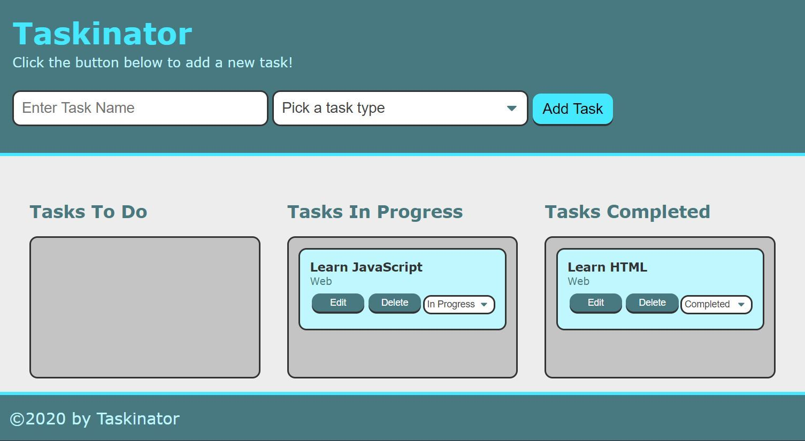

# Taskinator

## Description
Module 4 | Project
Task-tracker application

## Table of Contents
* [Usage](#usage)
* [Links](#links)
* [Tools](#tools)
* [Credits](#credits)
* [Skills Learned](#skills-learned)
* [Mock Up](#mock-up)
* [Steps](#steps)

## Usage
Personal Task-Tracker
[Mock Up Screenshot](/assets/images/mock-up.png)

## Links
### Links that Helped me along the way:
* [javascriptbook](https://javascriptbook.com/code/)
* [W3Schools - JavaScript Arrays](https://www.w3schools.com/js/js_arrays.asp)
* [W3Schools - JavaScript Functions](https://www.w3schools.com/js/js_functions.asp)

## Tools
* HTML elements, attributes, and properties
* CSS class selectors
* JavaScript functions
* Web Storage API
* Git and GitHub

## Credits
GitHub: [Brian Lockhart](https://github.com/bslockhart)
GitHub: [Deployed Application](https://bslockhart.github.io/Taskinator)

### Skills Learned
* Create variables to store the quiz questions
* Use mouse-click events to start the quiz
* Write for loops to cycle through quiz questions
* Use key-press events to receive user input in the form of answers to quiz questions
* Create a time limit for the game using time functions
* Write conditional statements to determine wrong and right answers
* Use client-side storage to store high scores
* Use GitHub Pages to publish the page to the web

## Mock Up
The following mock up image shows required display:

### Steps:
1. Set up the project in GitHub. We'll create a GitHub repository and clone it on our local machine.
2. Create GitHub issues and development branches. We'll create the GitHub issues that we'll use to track our progress on this project. We'll also create a develop branch and our first feature branch.
3. Build the HTML and CSS. We'll use HTML and CSS to create the basic Taskinator structure and design.
4. Create a DOM element. We'll learn about the DOM and create a DOM element for the "Add Task" button.
5. Capture the button click. We'll observe the user's click of the <button> element and create a response from that click.
6. Add task items by clicking a button. Finally, we'll add code that allows the user to add tasks to the Tasks To Do list when they click the "Add Task" button.
